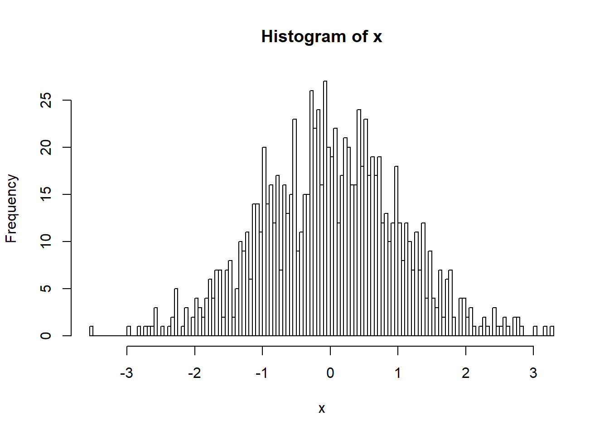

# Statistical Analysis of High-Throughput Genomic and Transcriptomic Data (UZH) 2017
This repository houses code from the course [Statistical Analysis of High-Throughput Genomic and Transcriptomic Data](http://www.vvz.ethz.ch/Vorlesungsverzeichnis/lerneinheitPre.do?lerneinheitId=116608&semkez=2017W&lang=en).

Just show some image:
